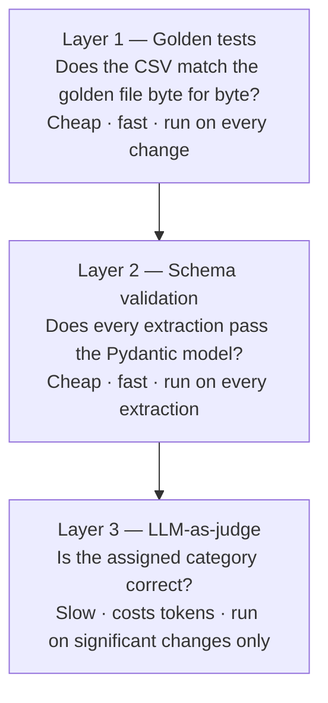
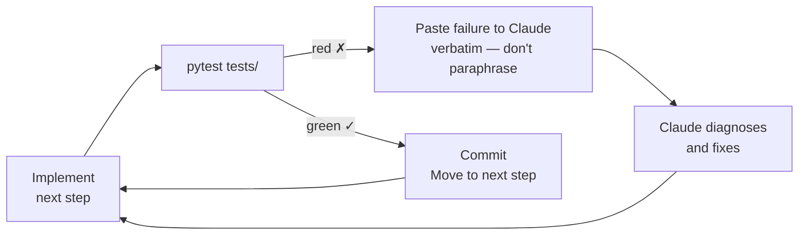

# The Eval Harness

**What is an eval?** An eval — short for evaluation — is a saved input, the known-right answer, and an automated check that they match. Nothing more. The simplest eval for this project is two files: `inbox/sample_01.txt` (the input) and `tests/golden/may.csv` (the answer you hand-labelled), connected by a `pytest` test that runs the tool and diffs the output. If the diff is empty, the test passes. If it doesn't, the failure message is the brief you hand back to Claude. No framework required. Write it in an afternoon.

The single most important file in the workshop is `tests/test_report.py`. Everything else is supporting cast.

**The thesis:** an LLM application is not "done" because the demo worked. It is done when you have a repeatable, automated way to know whether a change made it better or worse. That's what this harness is.

## Three layers, ~80 lines total



| Layer | What it checks | Cost | When to run |
|---|---|---|---|
| **Layer 1 — Deterministic golden tests** | Does the CSV match the golden file byte for byte? | Cheap, fast | On every change |
| **Layer 2 — Schema validation** | Does every extraction validate against the Pydantic model? | Cheap, fast | On every extraction |
| **Layer 3 — LLM-as-judge** | Is the category assigned to each receipt correct? | Slow, spendy | On significant changes only |

## Layer 1 — Deterministic golden tests

These tests do not call Claude. They call your CLI, which reads pre-recorded fixtures from `tests/fixtures/extractions/*.json` (JSON files are a common format for storing structured data — think a spreadsheet row saved as plain text). The Claude API is mocked out in `conftest.py` — "mocked out" means replaced with a stand-in that returns the same pre-recorded answers every time, so tests are free, instant, and produce identical results regardless of what the real model would say today.

```python
# tests/test_report.py
from pathlib import Path
import subprocess

GOLDEN = Path("tests/golden")

def test_may_report_matches_golden(tmp_path, seed_ledger):
    """seed_ledger copies a known ledger.db into tmp_path and chdirs there."""
    out = subprocess.run(
        ["receipts", "report", "--month", "2026-05", "--format", "csv"],
        capture_output=True, text=True, check=True,
    ).stdout
    assert out == (GOLDEN / "may.csv").read_text()


def test_idempotent_add(tmp_path, fresh_repo):
    """Adding the same folder twice produces zero new rows the second time."""
    first = subprocess.run(
        ["receipts", "add", "inbox/"],
        capture_output=True, text=True, check=True,
    )
    second = subprocess.run(
        ["receipts", "add", "inbox/"],
        capture_output=True, text=True, check=True,
    )
    assert "added 10" in first.stdout
    assert "added 0" in second.stdout
    assert "skipped 10 duplicates" in second.stdout
```

This is the "code-based grading" pattern from Anthropic's evals cookbook: *"This is by far the best grading method if you can design an eval that allows for it, as it is super fast and highly reliable."*

## Layer 2 — Schema validation

Every extraction passes through a Pydantic model — Pydantic is a Python library that acts like a strict form validator: it checks that every field is present, in the right format, and within allowed values. If Claude returns malformed data (a date written the wrong way, a negative price, a made-up category), the validator rejects it before anything reaches the ledger.

```python
# src/receipts/extract.py
from pydantic import BaseModel, Field
from typing import Literal
from pathlib import Path

class Extraction(BaseModel):
    date: str = Field(pattern=r"^\d{4}-\d{2}-\d{2}$")
    vendor: str
    category: Literal[
        "groceries", "dining", "transport", "utilities", "office", "other"
    ]
    amount: float = Field(ge=0)
    currency: str = Field(pattern=r"^[A-Z]{3}$")
    confidence: float = Field(ge=0.0, le=1.0)


def extract_receipt(path: Path) -> Extraction:
    raw = call_claude(path)                    # returns dict
    return Extraction.model_validate(raw)      # raises on schema drift (i.e. if the model's output format changes)
```

Fast feedback, no human judgment required. If a new model release returns slightly different JSON, this layer catches it on the first run.

## Layer 3 — LLM-as-judge (optional)

A short script that takes the ten sample receipts, runs `extract_receipt` on each, and asks a separate Claude call whether the assigned `category` is correct given the receipt content. **Binary PASS/FAIL**, not a 1–5 scale. Hamel Husain's guidance is direct:

> *"Don't use 1–5 scales. They're noise. Use PASS/FAIL."*

```python
# tests/eval_categories.py
"""Run with: python -m tests.eval_categories"""
import json
from pathlib import Path
from anthropic import Anthropic

client = Anthropic()

JUDGE_PROMPT = """\
You will be given (1) the raw text or description of a receipt and
(2) the category our system assigned.

Reply with exactly PASS or FAIL.

A category is PASS if it matches what a reasonable person would file
the receipt under given the vendor and items. Be strict. Borderline
cases that could plausibly go either way are FAIL.

Receipt:
{receipt}

Assigned category: {category}
"""


def judge(receipt_text: str, assigned_category: str) -> str:
    response = client.messages.create(
        model="claude-sonnet-4-6",
        max_tokens=10,
        messages=[{
            "role": "user",
            "content": JUDGE_PROMPT.format(
                receipt=receipt_text, category=assigned_category
            ),
        }],
    )
    return response.content[0].text.strip()


if __name__ == "__main__":
    # Load extractions, run judge on each, report pass rate
    extractions = json.loads(Path("ledger.json").read_text())
    results = [
        judge(e["source_text"], e["category"]) for e in extractions
    ]
    passes = results.count("PASS")
    total = len(results)
    print(f"{passes}/{total} categories PASS")
    print("Target: 8/10 or better")
```

We don't run Layer 3 during the 2-hour workshop. The file ships in the repo as a starting point for anyone who wants to add it later.

## How to use the harness in the build loop



The rhythm:

1. **Implement** the next step from the plan.
2. **Run** `pytest tests/`.
3. **If red:** paste the failure verbatim into Claude (do not paraphrase, do not summarise). The failure message — called a traceback — shows exactly which line of code failed and why. Claude reads it the same way a mechanic reads an error code. Let Claude diagnose.
4. **If green:** commit. Move to the next step.

The first time a test fails and Claude fixes it from a pasted traceback, the room understands the workshop. That's Block 4.

## Why we don't build a dashboard

Because the workshop is two hours and the dashboard isn't the lesson. Hamel's "A Field Guide to Rapidly Improving AI Products" (O'Reilly, July 2025) does argue you should build a data viewer eventually — *"teams with thoughtfully designed data viewers iterate 10x faster than those without them"* — but for a small project the printed page on the table is the viewer. The lesson is that **evals are a small piece of code you can write in an afternoon, not a framework you buy.**

## The pass-rate question

A test suite doesn't need 100% pass rate to be useful. Hamel again:

> *"Unlike traditional unit tests, you don't necessarily need a 100% pass rate. Your pass rate is a product decision."*

For Layer 1 and Layer 2 we *do* target 100% — they're deterministic and binary. For Layer 3 the target is 8/10 PASS on the supplied samples. Below that, look at the failures and decide whether to fix the prompt, fix the schema, or accept the failure mode.

[← Back to home](index.html)
