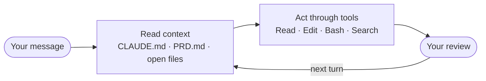
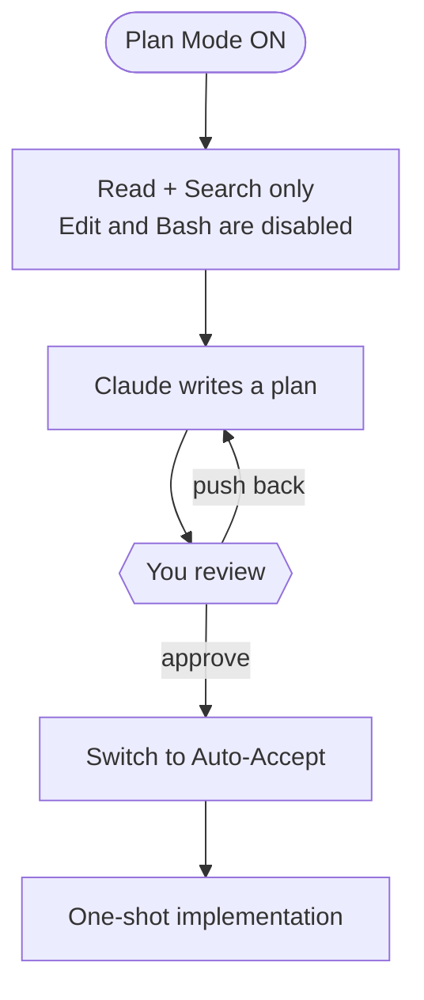

# How Claude Code Actually Works — and Why This Workshop Is Built This Way

*For attendees who want the theory behind the steps.*

---

## The mental model: the loop

Claude Code is not a chatbot with a terminal attached. It is an agentic loop — a model that reads context, acts through tools, and waits for your review.

Each turn works like this:

1. **Read context.** Claude reads your message, `CLAUDE.md`, `PRD.md`, and any files it has opened so far. This happens on *every* turn — not just the first one. The quality of your context files determines the quality of the output.
2. **Act through tools.** Claude can Read files, Edit files, Run Bash commands, Search across a codebase. Each tool call is visible to you before it executes (in default mode). You are in the loop.
3. **Wait for your review.** Claude stops after each action. It doesn't chain 200 edits together unilaterally.



**The critical implication:** you steer Claude Code by editing files, not by arguing in chat. A line in `CLAUDE.md` that says *"never call Claude inside a test"* does more work than a paragraph of in-prompt explanation — because it is re-read on every turn.

### Plan Mode: tool-level enforcement

When Plan Mode is on, the edit and bash tools are disabled at the framework level. Claude physically cannot write a file, run a command, or modify anything. It can only Read, Search, and produce a plan.

This is not a suggestion. It is enforced by the tool registry, not by Claude's willingness to comply. In Plan Mode you get a written plan, you read it, you push back on anything wrong, and then you approve. Boris Cherny, the engineer who built Claude Code: *"start in Plan Mode, iterate until the plan is right, switch to Auto-Accept, and let Claude one-shot the implementation. A good plan is really important."*



### Subagents

A subagent is a separate Claude session with its own context window and a narrower brief — defined as a Markdown file in `.claude/agents/`. It doesn't share context with the main session. Use subagents for isolated tasks (code review, security review, running a specific test suite) where you want a clean context, not accumulated history.

---

## The three theses, explained

The workshop opens with three claims. Here is what each one actually means.

### Thesis 1 — Structured intent beats clever prompting

The model fills every gap with an assumption. If you don't name the language, it picks one. If you don't define the output schema, it invents one. If you don't say what "done" looks like, it guesses.

A one-page PRD and a 60-line `CLAUDE.md` fill those gaps before the first token of code is generated. Once they do, the good prompt can be *short* — it doesn't need to specify everything in-prompt because the files already said it. The structure carries the load.

This is why the bad-vs-good demo lands: both prompts use the same model. The difference is not phrasing. It is the presence or absence of `PRD.md` and `CLAUDE.md`.

The pattern: **write the files before you write the prompt.**

→ *See: [Bad vs Good Prompts](bad-vs-good-prompts.md)*

### Thesis 2 — Verification makes the demo real

**What is an eval?** An eval — short for evaluation — is a saved input, the known-right answer, and an automated check that they match. Nothing more. The simplest eval for this project is two files: `inbox/sample_01.txt` (the input) and `tests/golden/may.csv` (the answer you hand-labelled), connected by a `pytest` test that runs the tool and diffs the output. If the diff is empty, it passes.

Why does this matter? Because "it looks right" is not a test. Demos always look right. The same build that passes an eyeball check will fail on the next receipt format you didn't think of, the next model update you didn't anticipate, or the next refactor a colleague makes next week. An eval suite catches those regressions automatically, on every change, forever. The eval suite is the compounding asset — the prompts come and go, models change, but the tests stay.

Hamel Husain, who has reviewed more LLM evaluation systems than almost anyone: *"In the projects we've worked on, we've spent 60–80% of our development time on error analysis and evaluation."* That is not a target to hit. It is a direction of travel. If you are spending 0% of your time on evals, you are building demos, not software.

When a test fails and you paste the failure into Claude — verbatim, not paraphrased — and Claude fixes it, you have closed the loop. That moment in Block 4 is what the workshop is for.

→ *See: [The Eval Harness](eval-harness.md)*

### Thesis 3 — Collaborator, not a genie

A genie grants wishes. A collaborator needs a brief.

Think of Claude Code as a sharp new hire who arrived this morning with no context about your project, no knowledge of your preferences, and no idea what "done" means for you. Given a clear brief — `PRD.md`, `CLAUDE.md`, a written plan it helped produce — it does exceptional work. Given a vague wish ("build me a receipts tool"), it makes reasonable guesses that compound into a codebase you didn't want.

The collaboration model has concrete implications:

- **Brief it before you run it.** `PRD.md` + `CLAUDE.md` exist so you brief Claude once, in a file, not on every prompt.
- **Read the plan before approving it.** Claude can be wrong. Plans are cheap to edit. Implementations are expensive to rewrite.
- **Correct it via files, not arguments.** If Claude keeps doing something wrong — wrong exit code, wrong sort order — the fix is a line in `CLAUDE.md`. Files persist across turns. Prompt arguments do not.
- **It should ask before structural changes.** If Claude is adding dependencies or changing schemas without asking, your `CLAUDE.md` needs a *"What to ask me about, never assume"* section.

The corollary: if something goes wrong repeatedly, look at your `CLAUDE.md` before blaming the model.

→ *See: [Plan Mode Walkthrough](plan-mode.md)*

---

## What a chat box structurally cannot do

There are things Claude Code does that ChatGPT, Claude.ai, Gemini, and every other chat interface cannot — not because of capability, but because of architecture. The chat box doesn't have these primitives.

### Files — iterate a folder, including files that arrive later

A chat interface works on one input at a time. You paste something in; it responds. There is no primitive for *"watch `inbox/` and process every receipt that lands there, including the one I'll drop in tomorrow."*

Claude Code runs as a process on your machine. It can read, write, and watch the filesystem. `receipts add inbox/` on a cron job is one line.

### Durable state — sessions that remember

Each chat session starts fresh. Yesterday's conversation is gone.

`ledger.db` doesn't forget. You ran `receipts add inbox/` last Tuesday; those entries are in the ledger. Running it again today adds this week's receipts and skips last week's with *"skipped N duplicates."* That idempotency guarantee — repeating the operation is always safe — is what the test harness checks. No chat interface has an equivalent.

### Determinism — same input, same output, testable

Ask Claude.ai a question twice and you will get two different answers. Useful for brainstorming. Disqualifying for software.

`receipts report --month 2026-05 --format csv` produces byte-identical output for a fixed ledger, every time, on every model version. This is what makes regression testing possible. You commit the golden file, change a line of code, run `pytest`, and know immediately whether the change broke anything.

### Composability — works with everything else

A chat response lives in a browser tab. A CLI is a process with stdin, stdout, stderr, and an exit code — the universal interface that everything else speaks.

```bash
receipts report --month 2026-05 --format csv | mail -s "May expenses" me@example.com
```

That's one line. A cron job, a Makefile, a GitHub Action, an MCP server, a bash script — they all talk to CLIs. None of them talk to chat tabs.

---

**The BLUF:** anything you can fully accomplish in a chat tab, you don't need Claude Code for. Anything that touches files, persistent state, schedules, or other tools is exactly what Claude Code is for. The gap between those two sentences is this workshop.

---

[← Back to home](index.html)
